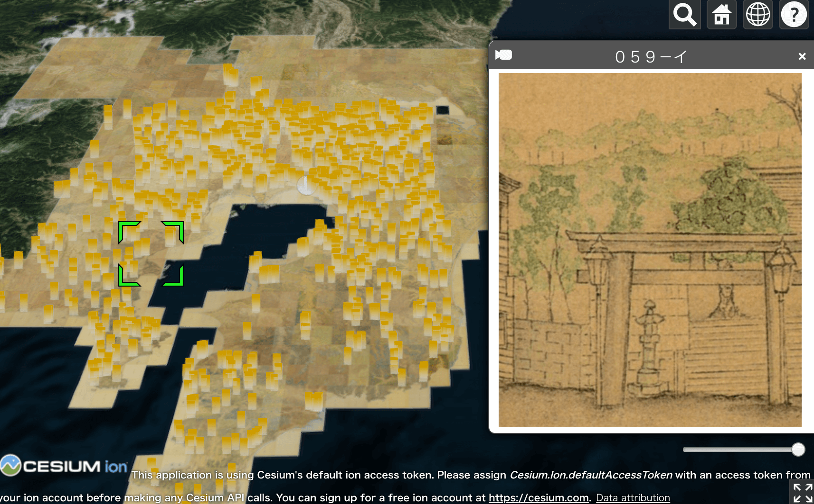

# resium-workshop

This is a repository for [Resium](https://github.com/darwin-education/resium) workshop at [FOSS4G-NA 2019](https://2019.foss4g-na.org/).

In this workshop, I’ll tell you how to use Resium, and we’ll work on building a Japanese archaic map archive. Resium is a new library, abstracting Cesium functions as React components, and helping to build a rich web 3D GIS web-application faster.



## Workshop Target

Anyone who have been interested in web front-end, React, or Cesium

## Workshop Goal

To create a Japanese archaic map archive with Resium, Cesium and React.

## Required Preparation

1. Install Git, Node.js (LTS) and your favorite text editor.
2. Clone this repository
3. Install modules: `npm install`

## Workshop Programs

### 1. Hello World

In this step, we try to display an entity in Cesium's viewer.

#### 1-1. Start development server

```
npm start
```

#### 1-2. Add an entity

```js
import { Cartesian3 } from "cesium";
import { Viewer, Entity } from "resium";
```

```jsx
<Viewer full>
  <Entity
    position={Cartesian3.fromDegrees(61, 130, 100)}
    point={{ pixelSize: 10 }} />
</Viewer>
```

#### 1-3. Change the entity's name and description

```jsx
<Viewer full>
  <Entity
    name="NAME"
    description="DESC"
    position={Cartesian3.fromDegrees(61, 130, 100)}
    point={{ pixelSize: 10 }} />
</Viewer>
```

#### 1-4. Write description in HTML

```js
import { Cartesian3 } from "cesium";
import { Viewer, Entity, EntityDescription } from "resium";
```

```jsx
<Viewer full>
  <Entity
    name="NAME"
    position={Cartesian3.fromDegrees(61, 130, 100)}
    point={{ pixelSize: 10 }}>
    <EntityDescription>
      <h1>Hello world</h1>
      <p>test</p>
    </EntityDescription>
  </Entity>
</Viewer>
```

#### 1-5. Try to change other properties

You will see how HMR (hot module replacement) works.

```js
import { Color, Cartesian3 } from "cesium";
import { Viewer, Entity, EntityDescription, PointGraphics } from "resium";
```

```jsx
<Viewer full>
  <Entity
    name="NAME"
    position={Cartesian3.fromDegrees(61, 130, 100)}>
    <PointGraphics pixelSize={100} color={Color.RED} />
    <EntityDescription>
      <h1>Hello world</h1>
      <p>test</p>
    </EntityDescription>
  </Entity>
</Viewer>
```

#### 1-6. Adjust camera position

```js
import { BoundingSphere, HeadingPitchRange } from "cesium";
import { Viewer, CameraFlyToBoundingSphere } from "resium";
```

```jsx
<Viewer full>
  <CameraFlyToBoundingSphere
    boundingSphere={new BoundingSphere(Cartesian3.fromDegrees(140, 35.7, 0), 0)}
    offset={new HeadingPitchRange(0, CesiumMath.toRadians(-30), 80000)}
    duration={3} />
</Viewer>
```

#### 1-7. Hide extra widgets

```js
<Viewer
  full
  animation={false}
  homeButton={false}
  timeline={false}
  baseLayerPicker={false} />
```

The first step is done!

### 2. Add Japanese archaic tile map

```js
import { createOpenStreetMapImageryProvider, createWorldImagery } from "cesium";
import { Viwer, ImageryLayer } from "resium";
```

```js
const defaultImageryProvider = createWorldImagery();

const imageryProvider = createOpenStreetMapImageryProvider({
  url: '//www.finds.jp/ws/tmc/1.0.0/Kanto_Rapid-900913-L/',
  ext: "jpg",
  zmin: 0,
  zmax: 18,
  credit: 'CC BY 国立研究開発法人農業環境技術研究所 歴史的農業環境閲覧システム',
});
```

```jsx
<Viewer full>
  <ImageryLayer imageryProvider={defaultImageryProvider} />
  <ImageryLayer imageryProvider={imageryProvider} />
</Viewer>
```

### 3. Load KML

```js
import { Viewer, KmlDataSource } from "resium";
```

```jsx
<Viewer full>
  <KmlDataSource
    data={process.env.PUBLIC_URL + "/doc.kml"}
    onLoad={dataSource => {
      // you can modify data source here
      dataSource.entities.values.forEach(e => {
        e.label = undefined;
      });
    }} />
</Viewer>
```

### 4. Add an effect: zoom to an entity when it is clicked

[React's ref](https://reactjs.org/docs/refs-and-the-dom.html) is used to access a raw object of Cesium.

```jsx
class App extends React.PureComponent {
  viewerRef = React.createRef();

  handleSelectedEntityChanged = () => {
    if (!this.viewerRef.current || !this.viewerRef.current.cesiumElement) {
      return;
    }

    const viewer = this.viewerRef.current.cesiumElement;
    const selectedEntity = viewer.selectedEntity;
    
    if (selectedEntity) {
      viewer.camera.flyToBoundingSphere(
        new BoundingSphere(selectedEntity.position.getValue(viewer.clock.currentTime), 1000),
        { duration: 1 }
      );
    }
  };

  render() {
    return (
      <Viewer
        full
        ref={this.viewerRef}
        onSelectedEntityChange={this.handleSelectedEntityChanged}>
        {/* ... */}
      </Viewer>
    );
  }
};
```

### 5. Add a slider to change tile alpha

```jsx
class App extends React.PureComponent {
  state = {
    tileAlpha: 100
  }

  handleTileAlphaChange = e => {
    this.setState({ tileAlpha: parseInt(e.currentTarget.value, 10) });
  }

  render() {
    return (
      <Viewer full>
        <ImageryLayer
          imageryProvider={imageryProvider}
          alpha={this.state.tileAlpha / 100} />
        <input
          type="range"
          min="0"
          max="0"
          value={this.state.tileAlpha}
          onChange={this.handleTileAlphaChange} />
      </Viewer>
    )
  }
}
```

### 6. [ADVANCED] Add splash screen

Please refer to [`completed` branch](https://github.com/darwin-education/resium-workshop/tree/completed).

## If you have a question

Please feel free to open a new issue in [GitHub issue](https://github.com/darwin-education/resium-workshop/issues).

## If you want to create a project from scratch

1. Install create-react-app: `npm install -g create-react-app`
2. Initialize a new project: `create-react-app PROJECT_NAME`
3. Set up craco-cesium to use Cesium: please follow [this guide](https://github.com/darwin-education/craco-cesium)
4. Set up craco-plugin-react-hot-reload to enable HMR: please follow [this guide](https://github.com/HasanAyan/craco-plugin-react-hot-reload)
5. Modify `App.js`:

```jsx
import React from 'react';
import { hot } from 'react-hot-loader';
import { Viewer } from 'resium';

class App extends React.PureComponent {
  render() {
    return <Viewer full />
  }
}

export default hot(module)(App);
```
